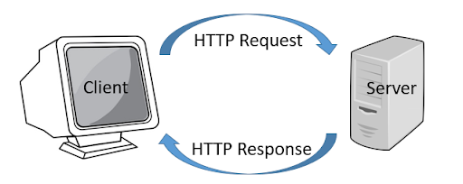

# HTTP Webserver From Scratch
## Implemented RFC of HTTP using SOCKET programming in python3




### Here's PseudoCode we are going to refer to while building HTTP server. 
```python
webserver {
	open a socket, bind to port 90
	listen
	t = accept();
	create a thread for t
	thread {
		s -> socket to exchange data for this particular connection
		loop {
			d = recvdata();
			interprete the data in d; // headers are to be deciphered
				string processing, tokenizing, making sense of data
				loop {
					l = next line();
					t = ':' separated list of tokens from l;
					swithch(t) {
						"Host": do something;
							carry some action on the server side;
							change some headers in the output (sent to browser);
						"User-Agent": do something;
						"GET":
							f = get the next part of "GET" // filename;
							open f;
							write HTTP headers into the socket;
							dump file f() into the socket;
						"if-modified-since":
							ht = get the 'time' given in header;
							ct = get current time;
							ft = get the time when file was modified;
							if(ft - ct < ht)
								just send headers in socket
							else
								send headers + file in socket;	
					}
				}	
		}	
	}
}
```